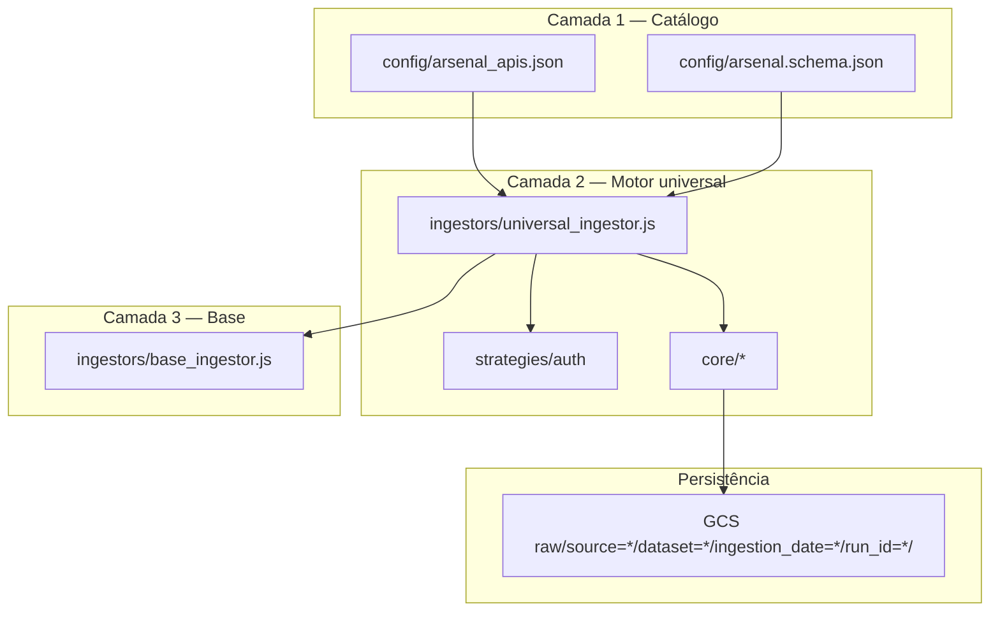

# transparenciabr-engines (Node)

Camada de ingestão declarativa para o datalake (`NDJSON.gz` em GCS, partições Hive).

## Arquitetura



## Comandos

```bash
npm run validate:catalog   # ajv contra o schema
npm run ingest:dry         # plano sem gravar
npm run ingest:imediata    # prioridade imediata
TARGET=transferegov_emendas npm run ingest:one
```

Variáveis principais: `DATALAKE_BUCKET_RAW`, `DATALAKE_BUCKET_STATE`, `GOOGLE_CLOUD_PROJECT`, segredos por API (`CGU_API_KEY`, etc.).

## Qualidade

- `npm run lint`
- `npm run test` (cobertura nos módulos `ingestors/core` e `ingestors/strategies`)

Docker / Cloud Build: `engines/Dockerfile`, `engines/cloudbuild.yaml`.
